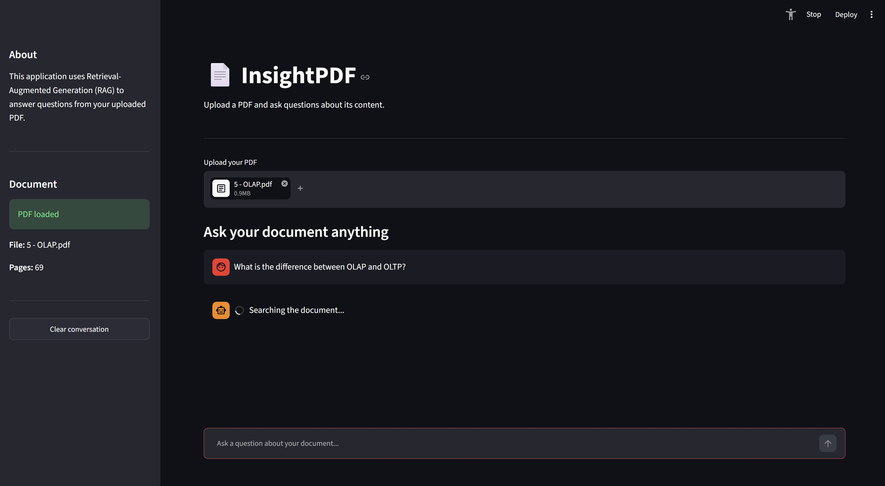

# RAG Document Q&A Assistant
An AI-powered PDF question-answering application built using Retrieval-Augmented Generation (RAG).
The application allows users to upload a PDF and ask questions about its content. Relevant information is retrieved from the document and passed to an LLM to generate an answer, along with the source pages used.
## Interface

## How It Works

1. Upload a PDF document
2. Extract and split the document into searchable chunks
3. Generate embeddings for the document
4. Retrieve relevant information for each question
5. Generate an answer using the retrieved context
6. Display the answer with the relevant source pages

## Tech Stack

Python · LangChain · ChromaDB · Sentence Transformers · Groq · Streamlit · PyPDF
